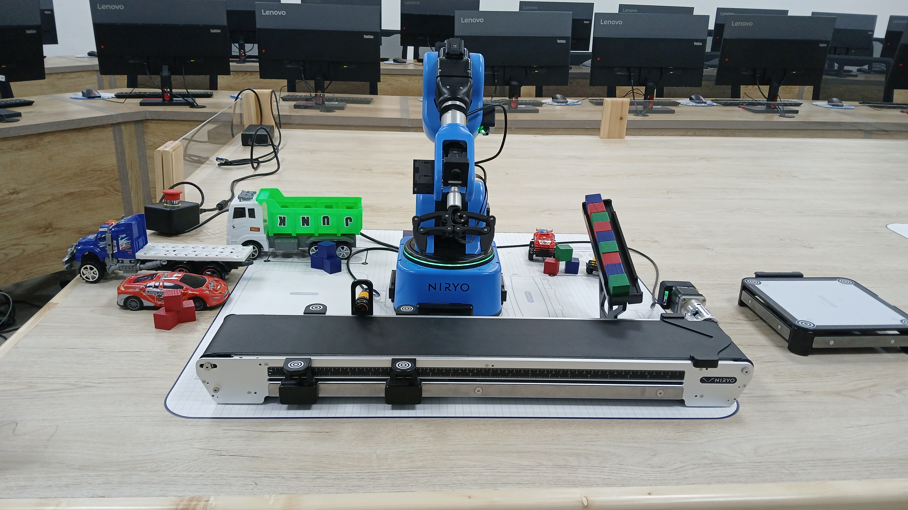

# Niryo Ned2 Vision-Guided Sorting System

A vision-guided robotic sorting system built using the **Niryo Ned2 robotic arm**, **Blockly programming**, and **Python ROS control**.

This project simulates an automated production-line environment where objects move along a conveyor belt, are detected using sensors and the robot’s vision system, and are picked and sorted based on their color.

---

# System Demonstration

## System Setup



*Niryo Ned2 robotic sorting system with conveyor, IR sensor, and colored cubes.*

---

## System Build Video
```markdown
[Watch the build process](video/system_build_and_demo.mp4)
```
## System Overview

The robotic system performs automated **pick-and-place sorting** using the following workflow:

1. Robot performs **automatic calibration**
2. Conveyor moves objects into the workspace
3. **IR sensor detects object arrival**
4. Robot moves to an **observation pose**
5. Vision system identifies **object color**
6. Robot picks the object
7. Object is placed in the correct sorting location
8. Stacks are updated dynamically

---

## Sorting Logic

Objects are sorted based on detected color.

| Color | Action |
|------|------|
| 🔴 Red | Pick and place into **Red stack** |
| 🔵 Blue | Pick and place into **Blue stack** |
| 🟢 Green | Move to **discard area** |

Stack height automatically increases after each placement using counters in the code.

Example logic:

```python
place_from_pose(..., 0.115 + Red_stack * 0.01)
```
## Hardware Components

The system includes the following hardware:

- **Niryo Ned2 robotic arm**
- **Adaptive gripper**
- **Conveyor belt**
- **Niryo vision camera**
- **IR sensor**
- **Workspace calibration marker**
- **Colored cubes (simulated objects)**

---

## Software Stack

The project integrates several software tools for robot control, perception, and automation:

- **Python**
- **ROS (Robot Operating System)**
- **Niryo ROS Python Wrapper**
- **Blockly (Niryo Studio)**

Blockly was used to visually design the robot control logic. The Blockly program was then exported as Python code using the Niryo ROS wrapper.

---

## Code Explanation

The Python script was generated from **Blockly logic** and executed using the **Niryo ROS Python wrapper**.

The code coordinates robot movement, sensor detection, conveyor control, and vision-based object sorting.

---

### Robot Initialization

```python
n = NiryoRosWrapper()
n.calibrate_auto()
```
This connects to the Niryo Ned2 robot and performs **automatic calibration**, ensuring that all joints and reference frames are properly initialized before the robot begins executing tasks.

Calibration is necessary to guarantee accurate robot positioning during pick-and-place operations.

---

### Conveyor Control

```python
n.control_conveyor(ConveyorID.ID_1, True, 100, ConveyorDirection.BACKWARD)

